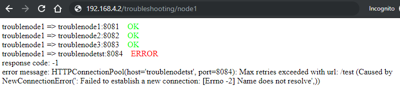

# netshootws
Docker image useful for debugging problems with routing in Docker swarm.

It's based on [nicolaka/netshoot](https://github.com/nicolaka/netshoot) image - adding to it a simple webservice that tries to connect to the same webservice, running on other nodes.

## How does it work?
The mentioned webservice exposes two endpoints: `/test` and `/`.

`/test` simply returns string `OK` (and response code 200)

`/` fetches `/test` endpoint from other nodes - and displays if it was successful

Keep in mind that you can always make a `docker exec -it CONTAINER_ID /bin/bash -l` into a running container and use any of tools provided by [nicolaka/netshoot](https://github.com/nicolaka/netshoot).

## Simple usage
```
docker run -it --rm -p 8081:8081 wregab/netshootws:latest --listen-on=0.0.0.0:8081 --my-name=node1 --others-names="host-to-test.domain.com;second-node:8082;third-node:8080"
```

Opening in browser `http://localhost:8081/` will fetch: `http://host-to-test.domain.com/test`, `http://second-node:8082/test` and `http://third-node:8080/test` (from the container, not your browser) - and display connection results.

## Usage in Docker Swarm
See an [example docker-compose file for swarm](example-swarm-docker-compose.yml).

Example of results:


